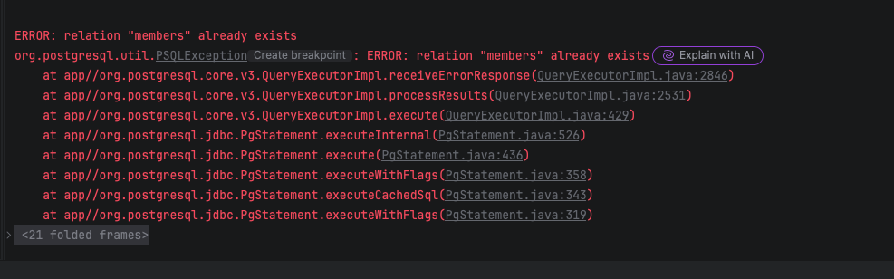

스프링 부트 테스트 환경에서 H2 데이터베이스로 연결되지 않는 현상을 마주했습니다.

왜 이런 일이 발생했을까요?

현상, 원인, 결과순으로 알아보겠습니다.

## 현상

`src/main/resources/application.yml`
```yaml
spring:
  application:
    name: 2026-springboot-datasource

  datasource:
    hikari:
      jdbc-url: jdbc:postgresql://localhost:5432/postgres
      username: postgres
      password: 5432
      driver-class-name: org.postgresql.Driver
```

테스트 환경에서는 H2 를 설정 했습니다.

`src/test/resources/application-test.yml`
```yaml
spring:
  datasource:
    url: jdbc:h2:mem:testdb
    driverClassName: org.h2.Driver
    username: sa
    password:
```

그리고 `schema.sql` 파일을 통해 스키마를 생성하고자 했습니다.



예외가 발생했습니다.

## 원인

위를 주의 깊게 봤다면 눈치챌 수 있습니다.

스프링은 기본적으로 조금 더 자세한 정보를 우선순위에 둡니다

그래서 `spring.datasource.` 보다 더 자세한 `spring.datasource.hikari.` 내용을 덮어쓰게 됩니다.

그래서 테스트 환경에서 실행을 해도 `application.yml` 의 내용이 적용된 것입니다.

## 결과

결과는 아주 간단합니다.

기본 프로필과 테스트 프로필 모두 `spring.datasource.` 으로 하거나,

`spring.datasource.hikari.` 로 적용 하면 됩니다.

일관적이지 못한 설정으로 발생한 에러 였습니다.

일관적으로 설정하는 의식과 연습이 필요할 거 같습니다.